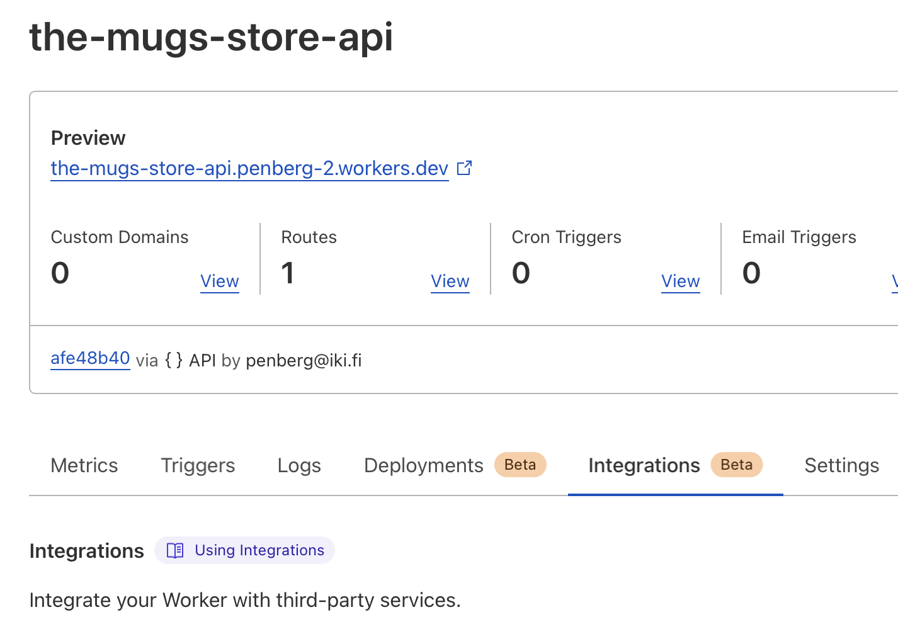

# The Mug Store API

This is a distributed REST API built using [Cloudflare workers] and [Turso] with
[Drizzle] used as the ORM.

## Database Setup

[Install the Turso CLI].

Create a new turso database.

```sh
turso db create the-mugs-store-api
```

> **Note**
>
> We use `the-mugs-store-api` as the database name in this command, but you can give
> it any name.

To access the data stored inside your database, you need the Turso database url
and an authentication token.

To obtain the database url, run the following command:

```sh
export TURSO_URL=$(turso db show the-mugs-store-api --url)
```

And, to create an authentication token for your database, run:

```sh
export TURSO_AUTH_TOKEN=$(turso db tokens create the-mugs-store-api)
```

## Local Setup

Add a `.env` file at the root of the project and inside it add the database url
and authentication token for your Turso database obtained in the previous step,
these variables will be used to assist in database migration with Drizzle.

```sh
echo "TURSO_URL = $TURSO_URL" > .env
echo "TURSO_AUTH_TOKEN = $TURSO_AUTH_TOKEN" >> .env
```

Also make the configuration visible to Wrangler:

```sh
cp .env .dev.vars
```

Then install all the dependencies with:

```sh
npm i
```

## Generate database schema, run migrations, and seed data

To generate the schema for the API database, run:

```sh
npm run generate
```

The command will create a new `migrations` directory under the `drizzle`
directory.

Next, run the following command to apply the migrations on the created Turso
database:

```sh
npm run migrate
```

And lastly, seed the database with some data by running:

```sh
npm run seed
```

## Local Development

Run the following command to start the development server:

```sh
npm run start
```

## Deploy to Cloudflare Workers

If you don't have an account, then [create a Cloudflare account here]. After
verifying your email address, run the following command on your project's
workspace to authenticate it with Cloudflare workers:

```sh
npx wrangler login
```

Lastly, deploy your Cloudflare workers project by running:

```sh
npm run deploy
```

You need to configure Turso integration in your Cloudflare Workers project.

You can either configure this at the integrations tab in your Cloudflare Workers dashboard:



Pick the Turso integration and follow the steps the UI gives you:


Alternative, run the following commands and copy-pasting the URL and the authentication token when prompted for them:

```sh
wrangler secret put TURSO_URL
wrangler secret put TURSO_AUTH_TOKEN
```

## More information

For more information, visit the following links:

- [Cloudflare workers Docs]
- [Turso Docs]
- [Drizzle Docs]

[Cloudflare workers Docs]: https://developers.cloudflare.com/workers/
[Cloudflare workers]: https://developers.cloudflare.com/workers/
[Turso Docs]: https://docs.turso.tech/
[Drizzle Docs]: https://orm.drizzle.team/
[Install the Turso CLI]: https://docs.turso.tech/reference/turso-cli#installation
[Turso]: https://turso.tech/
[Drizzle]: https://github.com/drizzle-team/drizzle-orm
[create a cloudflare account here]: https://dash.cloudflare.com/sign-up
